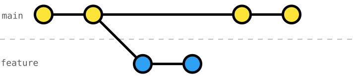
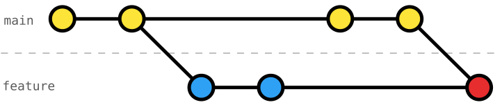
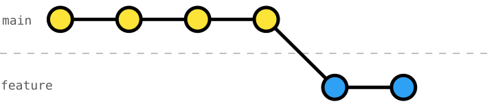

# 104 Rebase onto `main`

When working in a team (or on several changes at once), we might want to use short-lived branches (i.e., integrated into `main` within hours).
It is unavoidable that `main` will have commits that are more recent than those on our `feature` branch.



There are two ways to integrate the changes in `main`.

One way is to **merge `main` into `feature`** branch with [`git merge`](https://git-scm.com/docs/git-merge).



This leads to a non-linear, often messy Git history, which can never be linearized again; and in fact, prevents us from cleaning up our history.
With a non-linear, messy history, we might encounter changes in our branch that are not ours (integrated with the _merge commit_), reverting can be less straightforward, and investigating the history (e.g., _"what happened?"_ and debugging with `git bisect`) is more challenging.

The second way is to **rebase `feature` onto `main`** with [`git rebase`](https://git-scm.com/docs/git-rebase); in other words, re-applying our changes starting with a new _base_ leading to a linear history. Think of it _"as if we started our branch later"_.



`git merge` and `git rebase` mainly differ in how they incorporate changes and represent history.
_Merge_ preserves the actual branching and integration history, while _rebase_ rewrites commits to produce a cleaner, linear history.

Many problems often attributed to `git merge` vs. `git rebase` aren't inherent to either approach.
Expensive conflicts, repeated conflict resolution, late integration issues, and changes that merge cleanly but don't work together are usually consequences of late integration and long-lived, diverging branches.
Neither approach solves these underlying coordination and integration problems.

## Exercise Context

We are working on a _Smart Home_ project, where its configuration is split across three primary data files: `rooms.json`, `devices.json`, and `automation-rules.json`.

Following [exercise 101](../101-local-amend-commit/README.md) to [103](../103-local-undo-last-commit/README.md), we successfully installed all of our _living-room devices_ and finished implementing an automation rule for the _living room lights_.

It's time to integrate our feature branch; however, `main` has advanced in the meanwhile.

## Task: Rebase the Feature Branch onto `main`

While we were working on the light automation, our team installed further devices and sensors, as well as, _cherry-picked_ the _automation-rules schema_.

Before we finish our feature branch, it's a good practice to integrate `main` into our branch and make sure our changes work when integrated.
To this end, use [`git rebase`](https://git-scm.com/docs/git-rebase) to rebase our branch `living-room-automation` onto `main`.

### Deep Dive
After the rebase onto `main`, investigate what happened to the commits `"define automation-rules schema"` and `"define living-room-light trait on-off"` of the branch `living-room-automation`.

### Initial Git History
```console
$ git log --oneline --graph --decorate --all
* f30d539 (main) define automation-rules schema
* 2461e1b install living-room thermostat sensor
* 97070dc install living-room balcony-door sensor
* 25dc6e3 install living-room AC
| * 3edb867 (HEAD -> living-room-automation) automate turning on/off the living-room light
| * 51f3204 define automation-rules schema
| * 70865e0 define living-room-light trait on-off
|/
* b2a2383 install living-room ambient-light sensor
* 0301603 install living-room presence sensor
* 0e8a75e install living-room light
* 8db8515 define devices schema
* 95060db register living room
* bbcecc8 define rooms schema
* 9315fb1 write README
* dbc3611 configure Git
```
_Note_: The branch `living-room-automation` is checked out, thus the `HEAD` is at `3edb867`.

### Target Git History
```console
$ git log --oneline --graph --decorate --all
* 9e28e3b (HEAD -> living-room-automation) automate turning on/off the living-room light
* 3c69fc3 define living-room-light trait on-off
* f30d539 (main) define automation-rules schema
* 2461e1b install living-room thermostat sensor
* 97070dc install living-room balcony-door sensor
* 25dc6e3 install living-room AC
* b2a2383 install living-room ambient-light sensor
* 0301603 install living-room presence sensor
* 0e8a75e install living-room light
* 8db8515 define devices schema
* 95060db register living room
* bbcecc8 define rooms schema
* 9315fb1 write README
* dbc3611 configure Git
```
_Note_: Since we rebased the branch `living-room-automation` onto `main`, all the branch commit IDs have changed.
