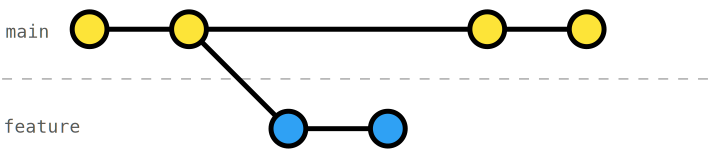
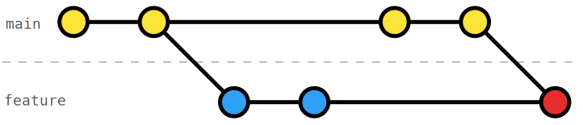
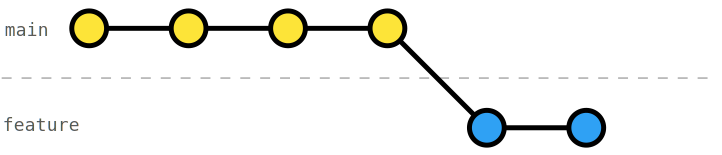

# Rebase onto main

Often, we aren't working alone (or not working one thing at a time). Thus, it's typical that `main` has commits that are newer than those on our `feature` branch.

There are two ways to integrate the changes in `main`. One way is to **_merge `main` into `feature`_** branch. However, this leads to a non-linear history.

The second way is to **_rebase `feature` onto `main`_**; in other words, reapplying our changes starting with a new _base_. This leads to a linear history. The command is [`git rebase`](https://git-scm.com/docs/git-rebase).

## Exercise

In this exercise, the _RocketFuel_ readme was committed on `main`, while we were working the first functionality in our `feature`. Rebase the `feature` onto `main` so that you have a linear history; i.e. it should look like you have started after the _RocketFuel_ readme commit. 