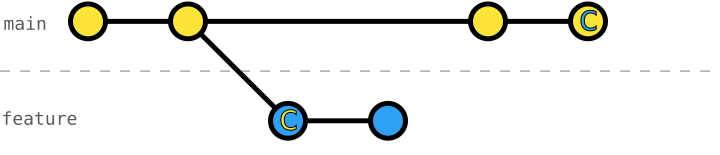

# 105 Rebase onto `main` with Conflicts

Regardless of whether we use [`git merge`](https://git-scm.com/docs/git-merge) or [`git rebase`](https://git-scm.com/docs/git-rebase) to integrate branches, we potentially need to resolve merge conflicts.



While with `git merge` the conflict is resolved in the merge commit, `git rebase` will stop at each problematic commit, and we need to resolve the conflicts in the order of those commits.

Resolving conflicts during a rebase can be complex, especially if the conflicts are hidden within the code (semantic conflicts) and multiple commits are involved.
This is why most developers prefer to use `git merge` over `git rebase`.

However, the vast majority of merge conflicts can be easily avoided by making _atomic commit_ and integrating changes early and often (_short-lived branches_).
When a branch has only a couple (_1-5_) of _atomic_ commits, is _integrated_ with `main` continuously, and exists only for a short period of time, conflicts are less likely to occur.

## Exercise Context

We are working on a _Smart Home_ project, where its configuration is split across three primary data files: `rooms.json`, `devices.json`, and `automation-rules.json`.

Following [exercise 101](../101-local-amend-commit/README.md) to [103](../103-local-undo-last-commit/README.md), we successfully installed all of our _living-room devices_ and finished implementing an automation rule for the _living room lights_.

It's time to integrate our feature branch; however, `main` has advanced in the meanwhile.

## Task: Rebase the Feature Branch onto `main`

While we were working on the light automation, our team installed further devices and sensors, as well as, _cherry-picked_ the _automation-rules schema_ and worked on automating the _living-room AC_.

We are finishing our feature branch and want to integrate it.
But in contrast to [exercise 104](../104-local-rebase-onto-main/README.md), we didn't integrate for too long and now encounter merge conflicts.
Use [`git rebase`](https://git-scm.com/docs/git-rebase) to rebase our branch `living-room-automation` onto `main`, and resolve the emerging conflicts.

Before executing the _rebase_ though, try to identify which commits will cause conflicts and prepare accordingly.

### Initial Git History
```console
$ git log --oneline --graph --decorate --all
* 3576afb (main) automate living-room AC
* c2c6516 define automation-rules schema
* 901a8f7 install living-room thermostat sensor
* 9e9db27 install living-room balcony-door sensor
* a4dcc86 install living-room AC
| * 24189cb (HEAD -> living-room-automation) automate turning on/off living room wall lamp
| * 9852d2b install living-room wall lamp
| * ff58bf0 automate turning on/off the living-room light
| * 811951b define automation-rules schema
| * c173e66 define living-room-light trait on-off
|/
* 4af729b install living-room ambient-light sensor
* a115cf6 install living-room presence sensor
* db1dab9 install living-room light
* 4016796 define devices schema
* 6082fdf register living room
* 4310a75 define rooms schema
* 6d223d7 write README
* 1ab9aab configure Git
```

### Target Git History
```console
$ git log --oneline --graph --decorate --all
* c2a2bfc (HEAD -> living-room-automation) automate turning on/off living room wall lamp
* 4569584 install living-room wall lamp
* 299c6e8 automate turning on/off the living-room light
* ded6133 define living-room-light trait on-off
* 3576afb (main) automate living-room AC
* c2c6516 define automation-rules schema
* 901a8f7 install living-room thermostat sensor
* 9e9db27 install living-room balcony-door sensor
* a4dcc86 install living-room AC
* 4af729b install living-room ambient-light sensor
* a115cf6 install living-room presence sensor
* db1dab9 install living-room light
* 4016796 define devices schema
* 6082fdf register living room
* 4310a75 define rooms schema
* 6d223d7 write README
* 1ab9aab configure Git
```
