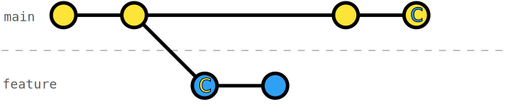

# Rebase onto main with conflicts

When integrating changes of another branch, e.g., `main` into `feature`, the changes on those branches might be in conflict.

Similar as with Git merge, when performing [`git rebase`](https://git-scm.com/docs/git-rebase) we need to resolve conflicts in order to have a working code base.

## Exercise

In this exercise, a change was committed to `main` that conflicts with a change you made on `feature`. Rebase `feature` onto `main` and resolve the conflict in the process.

_Bonus_: Note that Git detects only conflicts between chunks. It doesn't know about any syntax or semantics of your code base. Resolve the _hidden_ conflict within the corresponding commit.