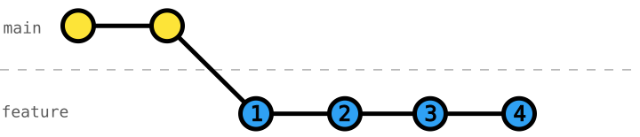
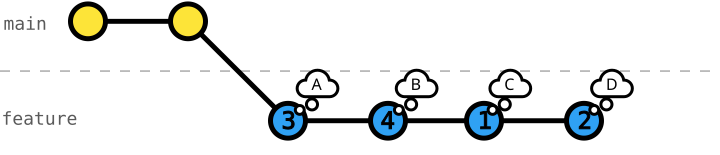

# 106 Interactive Rebase - Re-order Commits

[Interactive rebase](https://git-scm.com/docs/git-rebase#_interactive_mode) lets us work on problems naturally, commit changes as we go, and make our Git history more coherent and readable afterward.

It is only natural that we work on problems in a non-linear fashion.
- We have an idea on how to start 💡
- We experiment and try a solution 🔦
- We stumble upon a problem and fix it 🐞
- We get stuck and leave work unfinished (_WIP_) ⏸
- We revise solutions 🔧
- We finish something worthy to integrate ↗

While technically a chronological sequence of commits _"is how work happened"_, it is hard to comprehend and retrace the _"story"_.

Integrating the messy sequence of commits would be easy but quite hard to read and understand.
It would be like reading the raw and unorganized _author's notes on a book_.

We want to achieve a more readable, better discoverable, clearer Git history, so we need a more powerful tool than _amend commit_ or _soft reset_ to _"refactor"_ our Git history: [`git rebase -i`](https://git-scm.com/docs/git-rebase#Documentation/git-rebase.txt--i).

This exercise will help you understand how to use _interactive rebase_ to _re-order_ commits.

The following graph shows `feature` branch commits in chronological order:



After _re-ordering_ these to a coherent order with _interactive rebase_:



## Exercise Context

We are working on a _Smart Home_ project, where its configuration is split across three primary data files: `rooms.json`, `devices.json`, and `automation-rules.json`.

While our team is working on _automating_ the _living-room light_ ([exercise 101](../101-local-amend-commit/README.md) to [104](../104-local-rebase-onto-main/README.md)), we _cherry-picked_ their _automation-rules schema_ and started the work on _automating_ the _living-room AC_.

## Task: Re-order Commits using Interactive Rebase

In this exercise, we committed our work on `living-room-ac-automation` in chronological order.

However, those commits are in a non-ideal order to understand what is being achieved.
For example, commits that conceptually belong together like `"define automation-rules schema"` and `"automate living-room AC"` are far apart.

Further, some commits are technically broken, e.g.:
- `"install living-room AC"` uses the property `traits`, but the schema is fixed only after that commit with `"define traits for devices"`
- `"automate living-room AC"` uses `sensorDeviceId`s that are only defined with the next commit `"install living-room sensors"`

_Re-order_ the commits on `living-room-ac-automation` to tell a coherent story.

### Initial Git History
```console
$ git log --oneline --graph --decorate --all
* 01453a4 (HEAD -> living-room-ac-automation) install living-room sensors
* c5022d9 automate living-room AC
* f047bde define traits for devices
* b53944f install living-room AC
* 46ceb87 define automation-rules schema
| * b37d325 (living-room-automation) automate turning on/off the living-room light
| * 9ce53f0 define automation-rules schema
| * 88e0d8e define living-room-light trait on-off
|/
* 6734841 (main) install living-room ambient-light sensor
* 2479fce install living-room presence sensor
* 8d4a469 install living-room light
* 1c53771 define devices schema
* d8f5025 register living room
* 0208f0f define rooms schema
* 9e76d4d write README
* 5bea84e configure Git
```
_Note_: We also see the feature branch `living-room-automation` here, but it isn't relevant to this exercise.

### Target Git History
```console
$ git log --oneline --graph --decorate --all
* bf3e297 (HEAD -> living-room-ac-automation) automate living-room AC
* 45e9569 define automation-rules schema
* 336fdf1 install living-room sensors
* c011f2d install living-room AC
* 74576bd define traits for devices
| * b37d325 (living-room-automation) automate turning on/off the living-room light
| * 9ce53f0 define automation-rules schema
| * 88e0d8e define living-room-light trait on-off
|/
* 6734841 (main) install living-room ambient-light sensor
* 2479fce install living-room presence sensor
* 8d4a469 install living-room light
* 1c53771 define devices schema
* d8f5025 register living room
* 0208f0f define rooms schema
* 9e76d4d write README
* 5bea84e configure Git
```
_Note_: The commit IDs after the re-ordering have changed because to Git, commits aren't isolated patches with an ID but rather changes in a hierarchical order.
