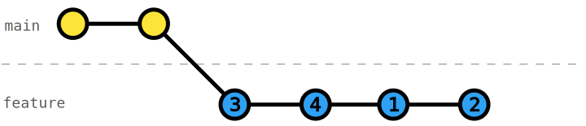

# Interactive rebase - Re-order commits

Often, we work on items in a non-chronological order. 

Thus, we want to change the order of commits to achieve a better history log. We can use [interactive rebase](https://git-scm.com/docs/git-rebase#_interactive_mode) [`git rebase -i`](https://git-scm.com/docs/git-rebase#Documentation/git-rebase.txt--i) to _re-order_ commits.

## Exercise

In this exercise, we committed some changes in a non-ideal order. Re-order the commits such that the _RocketFuel_ readme is first, then the commits for _Mass_ and _Fuel_, and lastly, the commit for estimating the fuel. 