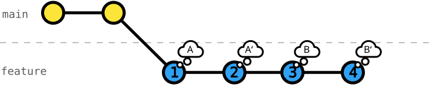
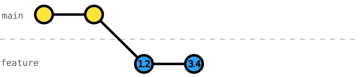

# 107 Interactive Rebase - Squash Commits

[Interactive rebase](https://git-scm.com/docs/git-rebase#_interactive_mode) lets us work on problems naturally, commit changes as we go, and make our Git history more coherent and readable afterward (cf. [exercise 106](../106-local-interactive-rebase-reorder-commits/README.md)).

Sometimes we find that too small commits appear fragmented and disjointed.
Sometimes we need to fix or improve on something in a several-commits earlier commit.

Combining (_squashing_) commits is another important tool to rewrite history towards coherent commits telling a clear _"story"_.
This exercise will help you understand how to use _interactive rebase_ [`git rebase -i`](https://git-scm.com/docs/git-rebase#Documentation/git-rebase.txt--i) to _squash_ commits.

The following graph shows `feature` branch commits in chronological order:



After _squashing_ these commits to be complete and self-contained with _interactive rebase_:



## Exercise Context

We are working on a _Smart Home_ project, where its configuration is split across three primary data files: `rooms.json`, `devices.json`, and `automation-rules.json`.

While our team is working on _automating_ the _living-room light_ (exercises `101` to `104`), we _cherry-picked_ their _automation-rules schema_ and started the work on _automating_ the _living-room AC_.

## Task: Squash Commits using Interactive Rebase

In this exercise, we committed our work on `living-room-ac-automation` in small commits.

However, the sequence of commits is quite fragmented.
For example, commits like `"fixup! devices schema"` (belongs to `"install living-room AC"`) and `"amend! install living-room sensors"` (belongs to `"install living-room sensors"`) make the Git log unnecessarily convoluted.

Further, one can argue that _automation_ is only complete with all rules in place, so `"turning on living-room AC"`, `"turning off living-room AC"`, and `"automate turning off living-room AC when balcony door opens"` can be combined into one commit  `"automate living-room AC"`.

_Squash_ the commits on `living-room-ac-automation` to tell a coherent story.

_Hint_: You can only squash commits that are next to each other, so you need to move some commits to be able to squash them.

_Nice to Know_: You can make use of the [`--autosquash`](https://git-scm.com/docs/git-rebase#Documentation/git-rebase.txt---autosquash) by prefixing a commit message with `"squash! ..."`, `fixup! ...`, or `amend! ...`.

### Initial Git History
```console
$ git log --oneline --graph --decorate --all
* 71f8476 (HEAD -> living-room-ac-automation) automate turning off living-room AC when balcony door opens
* 6c0afe8 amend! install living-room sensors
* eb52221 automate turning off living-room AC
* d27d2f8 automate turning on living-room AC
* e1d1ebd install living-room sensors
* 4a9f966 fixup! devices schema
* 97b2679 install living-room AC
* eb47066 define automation-rules schema
| * 135458b (living-room-automation) automate turning on/off the living-room light
| * 6bc9c53 define automation-rules schema
| * f0a0682 define living-room-light trait on-off
|/
* 3f39256 (main) install living-room ambient-light sensor
* 83b4ca2 install living-room presence sensor
* 79d6bed install living-room light
* 2efc971 define devices schema
* e63777f register living room
* a0be0a2 define rooms schema
* 18806df write README
* 3e2c173 configure Git
```
_Note_: The initial Git history of `living-room-ac-automation` slightly different from exercise `106` by design.

### Target Git History
```console
$ git log --oneline --graph --decorate --all
* e99ef08 (HEAD -> living-room-ac-automation) automate living-room AC
* ae8266e install living-room sensors
* 97cc672 install living-room AC
* eb47066 define automation-rules schema
| * 135458b (living-room-automation) automate turning on/off the living-room light
| * 6bc9c53 define automation-rules schema
| * f0a0682 define living-room-light trait on-off
|/
* 3f39256 (main) install living-room ambient-light sensor
* 83b4ca2 install living-room presence sensor
* 79d6bed install living-room light
* 2efc971 define devices schema
* e63777f register living room
* a0be0a2 define rooms schema
* 18806df write README
* 3e2c173 configure Git
```
_Note_: The commit IDs after squashing are different as the commits are new, and so their child commits new commit IDs as well.
