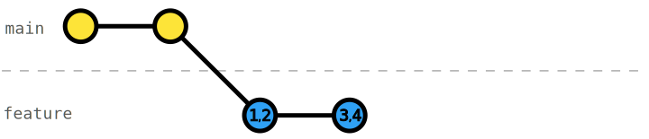

# Interactive rebase - Squash commits

It can be a good idea to commit each change. However, in retrospect, those changes might cause confusion. For example, changes that belong together are separated, there shouldn't be any _fixes_ to new code in the first place, or we forgot to add something that belongs to an earlier commit. 

We want to have a clean history with coherent commits telling a strong story, thus, we need to combine commits together. We can use [interactive rebase](https://git-scm.com/docs/git-rebase#_interactive_mode) [`git rebase -i`](https://git-scm.com/docs/git-rebase#Documentation/git-rebase.txt--i) to _squash_ commits.

## Exercise

In this exercise, we committed changes in small commits that are not coherent. Re-order and squash the commits on the `feature` branch, such that you have three coherent commits: one for the _RocketFuel_ readme, one for the mass and fuel types, and one for the fuel estimation.

_Hint_: You can only squash commits that are next to each other. So you need to re-order some commits.

_Tip_: When you know that some change belongs with an earlier commit, chose the same commit message with the prefix `squash! ...`. This way, you can make use of the [`--autosquash`](https://git-scm.com/docs/git-rebase#Documentation/git-rebase.txt---autosquash) option. 