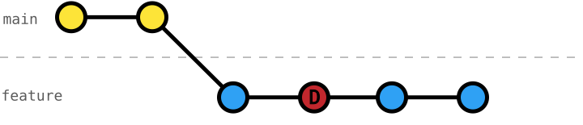
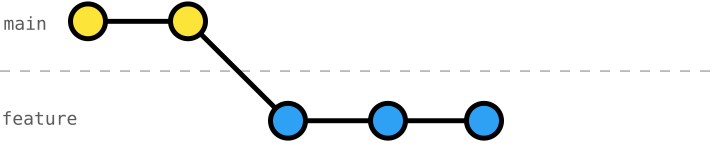

# 111 Interactive Rebase - Delete Commits

[Interactive rebase](https://git-scm.com/docs/git-rebase#_interactive_mode) lets us work on problems naturally, commit changes as we go, and make our Git history more coherent and readable before sharing it with others (cf. [exercise 106](../106-local-interactive-rebase-reorder-commits/README.md)).

An advantage to _atomic commits_ (small, coherent, and working) is that they support [rewriting history](https://git-scm.com/docs/git-rebase#_interactive_mode) very well.
So, instead of manually introducing changes to revert decisions or undo work-in-progress, we can simply _delete_ the corresponding commits.

This exercise will help you understand how to use [interactive rebase](https://git-scm.com/docs/git-rebase#_interactive_mode) [`git rebase -i`](https://git-scm.com/docs/git-rebase#Documentation/git-rebase.txt--i) to _delete_ commits.



After deleting the commit of the `feature` branch it's like it never existed:



## Exercise Context

We are working on a _Smart Home_ project, where its configuration is split across three primary data files: `rooms.json`, `devices.json`, and `automation-rules.json`.

While our team is working on _automating_ the _living-room light_ (exercises `101` to `104`), we _cherry-picked_ their _automation-rules schema_ and started the work on _automating_ the _living-room AC_.

Exercises [106](../106-local-interactive-rebase-reorder-commits/README.md) to [111](../111-local-interactive-rebase-delete-commits/README.md) have the same context, but with slightly different initial and target Git history to best support the exercise's focus.

## Task: Delete Commits using Interactive Rebase

In this exercise, we committed our work on `living-room-ac-automation` along with many test-related commits.

To test the automation rules, we set some test values.
But instead of mixing the test-related changes with our logic, we carefully separated them into their own commits.
This allows us to now simply remove those commits as if they never existed, instead of manually checking every file and reverting the changes manually.

Use _interactive rebase_ to _delete_ those commits to clean up our Git history before integrating our work.

### Initial Git History
```console
$ git log --oneline --graph --decorate --all
* 9fae271 (HEAD -> living-room-ac-automation) DELETE! balcony-door test value door-opened
* 98d79cb DELETE! thermometer test value 26°C
* 5eae5d0 DELETE! ac on/off with balcony-door testmode
* c2f63dd automate turning on/off living-room AC w/ balcony door
* 459e1f5 DELETE! balcony-door test value door-closed
* dc9f146 install living-room balcony-door sensor
* 7475fff DELETE! thermometer test value 19°C
* d71bd15 DELETE! ac off testmode
* aa7341a automate turning off living-room AC
* aa78a28 DELETE! thermometer test value 24°C
* e1ae49b DELETE! ac on testmode
* 26a970c automate turning on living-room AC
* 6eb6ff1 DELETE! thermometer test value 26°C
* b34232c install living-room thermostat sensor
* ab77be6 install living-room AC
* 0a8d1bc define automation-rules schema
| * 390de11 (living-room-light-automation) automate living-room light
| * c482c2f define automation-rules schema
| * 683cd7c define living-room-light trait on-off
|/
* b6175ca (main) install living-room ambient-light sensor
* ba422f3 install living-room presence sensor
* 106e3b1 install living-room light
* 5c996c3 define devices schema
* ce99479 register living room
* fa90519 define rooms schema
* 2f675cf write README
* 219782e configure Git
```

### Target Git History
```console
$ git log --oneline --graph --decorate --all
* a78a6be (HEAD -> living-room-ac-automation) automate turning on/off living-room AC w/ balcony door
* 9c7189d install living-room balcony-door sensor
* 95f7bd1 automate turning off living-room AC
* dce12c9 automate turning on living-room AC
* b34232c install living-room thermostat sensor
* ab77be6 install living-room AC
* 0a8d1bc define automation-rules schema
| * 390de11 (living-room-light-automation) automate living-room light
| * c482c2f define automation-rules schema
| * 683cd7c define living-room-light trait on-off
|/
* b6175ca (main) install living-room ambient-light sensor
* ba422f3 install living-room presence sensor
* 106e3b1 install living-room light
* 5c996c3 define devices schema
* ce99479 register living room
* fa90519 define rooms schema
* 2f675cf write README
* 219782e configure Git
```
