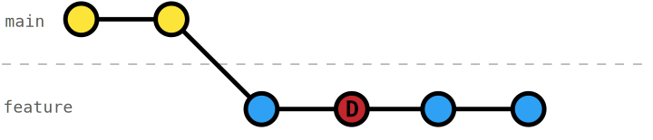

# Interactive rebase - Delete commits

When working on a feature, we might want to commit some temporary changes, e.g., debug settings to config, bypass authorization or feature flags, or some debug code for understanding. It's a good idea to commit those changes in their very own commit.

This way, we can use [interactive rebase](https://git-scm.com/docs/git-rebase#_interactive_mode) [`git rebase -i`](https://git-scm.com/docs/git-rebase#Documentation/git-rebase.txt--i) to _delete_ those temporary commits.

## Exercise

In this exercise, we committed a temporary main while working on the formula -- ignoring the fact that we could have written the unit tests directly. Delete the commit with the temporary main.

_Bonus_: Squash the commit for the unit tests into the commit with the estimate function.
