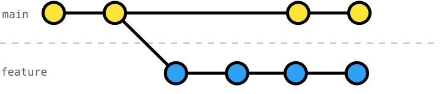
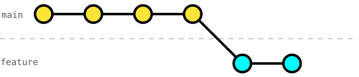

# 112 Interactive Rebase onto `main`

In [exercise 104](../104-local-rebase-onto-main/README.md), we learned how to integrate changes from `main` using _[rebase](https://git-scm.com/book/en/v2/Git-Branching-Rebasing)_ a branch onto `main`.



For more manageable changes, we can use _[interactive rebase](https://git-scm.com/book/en/v2/Git-Branching-Rebasing)_ [`git rebase -i`](https://git-scm.com/docs/git-rebase#Documentation/git-rebase.txt--i) (cf. [exercise 106](../106-local-interactive-rebase-reorder-commits/README.md) to [111](../111-local-interactive-rebase-delete-commits/README.md)) to rebase onto `main` and clean up our history in one go.



## Exercise Context

We are working on a _Smart Home_ project, where its configuration is split across three primary data files: `rooms.json`, `devices.json`, and `automation-rules.json`.

While our team is working on _automating_ the _living-room light_ (exercises `101` to `104`), we _cherry-picked_ their _automation-rules schema_ and started the work on _automating_ the _living-room AC_.

In the meantime, `living-room-light-automation` was integrated into `main`.

## Task: Rebase onto `main` using Interactive Rebase to Clean Up History

While we were working on _automating_ the _living-room AC_, our team integrated `living-room-light-automation` into `main`.
Our branch is also almost ready to be integrated into `main`.

To prepare the integration and _resolve conflicts_, use `git rebase -i main` to rebase onto `main` and clean up our history (cf. _target Git history_) in one go.

### Initial Git History
```console
$ git log --oneline --graph --decorate --all
* f6110e8 (HEAD -> living-room-ac-automation) ac on/off balcony-door
* dbd492e install balcony-door sensor
* 5ab2c26 ac off temp
* 074d7a7 ac on temp
* f3eb688 install thermometer
* 9ae6ee4 install ac
* 986ef20 define automation-rules schema
| * cc7b2f0 (main) automate living-room light
| * b85a1a9 define automation-rules schema
| * 8260331 define living-room-light trait on-off
|/
* 2ecb46f install living-room ambient-light sensor
* 25aaa25 install living-room presence sensor
* b2bd4dc install living-room light
* 4cbcfd5 define devices schema
* 991ec2a register living room
* fe66daa define rooms schema
* 5b8d964 write README
* d1b4b6e configure Git
```

### Target Git History
```console
$ git log --oneline --graph --decorate --all
* 9fb56c9 (HEAD -> living-room-ac-automation) automate turning off living-room AC
* bcbff7b install living-room sensors
* f22da0b install living-room AC
* cc7b2f0 (main) automate living-room light
* b85a1a9 define automation-rules schema
* 8260331 define living-room-light trait on-off
* 2ecb46f install living-room ambient-light sensor
* 25aaa25 install living-room presence sensor
* b2bd4dc install living-room light
* 4cbcfd5 define devices schema
* 991ec2a register living room
* fe66daa define rooms schema
* 5b8d964 write README
* d1b4b6e configure Git
```
_Note_: As we rebased `living-room-ac-automation` onto main, now `devices.json` and `automation-rules.json` have all devices, sensors, and rules for both _living-room light_ and _living-room AC_.
