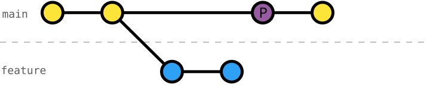
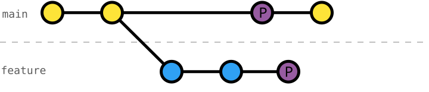

# 113 Cherry-pick Commits

Cherry-picking a commit is useful when we want to apply changes introduced by that commit in to another branch.

For example, we can use [`git cherry-pick`](https://git-scm.com/docs/git-cherry-pick) to selectively integrate a change, fix, or feature into our current branch without merging the entire source branch.

It can also be useful for building a clean, intentional history from a messy or experimental branch by cherry-picking only the commits that represent the changes you actually want to preserve.



With [`git cherry-pick`](https://git-scm.com/docs/git-cherry-pick) we can apply the changes of commit `P` to our current branch.



## Exercise Context

We are working on a _Smart Home_ project, where its configuration is split across three primary data files: `rooms.json`, `devices.json`, and `automation-rules.json`.

We started to install and automate the living-room AC, while our team is working on _automating_ the _living-room light_ (exercises `101` to `104`).

To continue our work, we need the _automation-rules schema_.

## Task: Cherry-pick a Commit from another Branch

The schema for automation rules `automation-rules.schema.json` is not yet integrated into `main` and we don't want to redefine ourselves.

To be sure we have the same version of `automation-rules.schema.json` as our team, we can cherry-pick the commit `"define automation-rules schema"` from branch `living-room-light-automation` onto our branch `living-room-ac-automation`.

This way we can continue our work on the living-room AC automation without waiting for the integration of `living-room-light-automation` into `main`.

Once either of the branches is integrated into `main`, a [rebase](https://git-scm.com/book/en/v2/Git-Branching-Rebasing) will simply remove the cherry-picked commit from the other branch.

### Initial Git History
```console
$ git log --oneline --graph --decorate --all
* 27932b0 (HEAD -> living-room-ac-automation) install living-room balcony-door sensor
* 4829d15 install living-room thermostat sensor
* 32a150b install living-room AC
| * 0be7489 (living-room-light-automation) automate living-room light
| * 5d5581d define automation-rules schema
| * dba85f9 define living-room-light trait on-off
|/
* 1db2a0d (main) install living-room ambient-light sensor
* b75a4ac install living-room presence sensor
* b394ff8 install living-room light
* 64377f3 define devices schema
* ec4930c register living room
* e932d83 define rooms schema
* 1429929 write README
* b8f3f4b configure Git
```

### Target Git History
```console
$ git log --oneline --graph --decorate --all
* 1633f87 (HEAD -> living-room-ac-automation) define automation-rules schema
* 27932b0 install living-room balcony-door sensor
* 4829d15 install living-room thermostat sensor
* 32a150b install living-room AC
| * 0be7489 (living-room-light-automation) automate living-room light
| * 5d5581d define automation-rules schema
| * dba85f9 define living-room-light trait on-off
|/
* 1db2a0d (main) install living-room ambient-light sensor
* b75a4ac install living-room presence sensor
* b394ff8 install living-room light
* 64377f3 define devices schema
* ec4930c register living room
* e932d83 define rooms schema
* 1429929 write README
* b8f3f4b configure Git
```
_Note_: Cherry-picking commit `"define automation-rules schema"` from branch `living-room-light-automation` results in different commit hash, but the changes are applied to brach `living-room-ac-automation` as a patch.
