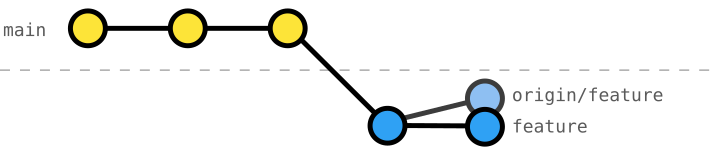

# 201 Gepushten Commit per Amend anpassen

Das Anpassen von Commits per Amend ist nützlich, wenn wir einen Tippfehler korrigieren, vergessene Änderungen hinzufügen oder die Logik im neuesten Commit verbessern möchten (vgl. [Übung 101](../101-local-amend-commit/README.md)).

Sobald ein Commit jedoch in ein Remote-Repository (`origin`) gepusht wurde, verändert ein Amend die Commit-Abfolge und unsere lokale Kopie weicht von der auf `origin` ab.
Ein Git-Client zeigt an dieser Stelle typischerweise so etwas wie `↓1 ↑1` an; d. h. unser lokaler Branch ist sowohl hinter `origin` zurück als auch voraus.



Git wird einen normalen `git push` ablehnen, um das Überschreiben der Historie auf dem Remote zu verhindern.
Um den Remote-Branch mit unserem umgeschriebenen Commit zu aktualisieren, müssen wir den Remote-Branch mit [`git push --force-with-lease`](https://git-scm.com/docs/git-push#Documentation/git-push.txt---force-with-lease) überschreiben.

_Tipp_: Die Verwendung von `--force-with-lease` ist sicherer als `--force`, da sichergestellt wird, dass wir den Remote-Branch nur überschreiben, wenn seit unserem letzten Fetch niemand sonst neue Commits darauf gepusht hat.

## Kontext der Übung

Wir arbeiten an einem _Smart Home_-Projekt, dessen Konfiguration auf drei primäre Datendateien aufgeteilt ist: `rooms.json`, `devices.json` und `automation-rules.json`.

Wir haben unsere ersten _Wohnzimmer-Geräte_ erfolgreich installiert und arbeiten nun an der _Automatisierung der Wohnzimmer-Beleuchtung_.

## Aufgabe: Commit per Amend anpassen und Änderungen force-pushen

Auf dem Branch `living-room-light-automation` arbeiten wir an der _Automatisierung der Wohnzimmer-Beleuchtung_.

Mit den finalen Änderungen sind wir bereit, die Automatisierung abzuschließen und _die Änderungen zu pushen_.
Wir haben unseren Zwischenstand (_WIP_) jedoch zuvor bereits nach `origin` gepusht, um unsere Änderungen zu sichern.

Passe den WIP-Commit mit den folgenden Änderungen per Amend an und gib ihm einen passenden Namen; z. B. `"automate living-room light"`:

```diff
--- a/automation-rules.json
+++ b/automation-rules.json
@@ -5,11 +5,14 @@
     {
       "id": "living-room-lights-on-presence",
       "name": "Turn on living-room lights when presence is detected",
-      "testMode": true,
       "when": [
         {
           "sensorDeviceId": "living-room-presence",
           "event": "presence-detected"
+        },
+        {
+          "sensorDeviceId": "living-room-ambient-light",
+          "sensorValue": "is-dark"
         }
       ],
       "then": [
@@ -22,7 +25,6 @@
     {
       "id": "living-room-lights-off-no-presence",
       "name": "Turn off living room lights when presence is no longer detected",
-      "testMode": true,
       "when": [
         {
           "sensorDeviceId": "living-room-presence",
@@ -35,6 +37,22 @@
           "action": "turn-off"
         }
       ]
+    },
+    {
+      "id": "living-room-lights-off-ambient-bright",
+      "name": "Turn off living room lights when ambient light is bright",
+      "when": [
+        {
+          "sensorDeviceId": "living-room-ambient-light",
+          "sensorValue": "is-bright"
+        }
+      ],
+      "then": [
+        {
+          "deviceId": "living-room-light",
+          "action": "turn-off"
+        }
+      ]
     }
   ]
 }
```

### Initiale Git-Historie
```console
$ git log --oneline --graph --decorate --all
* e22b66a (HEAD -> living-room-light-automation, origin/living-room-light-automation) WIP automation rules
* dc6f8e2 define automation-rules schema
* 06295d8 install living-room ambient-light sensor
* b0ecad5 install living-room presence sensor
* 3c557d0 define living-room-light trait on-off
* 80152be (origin/main, main) install living-room light
* 40912ed define devices schema
* 2d944e2 register living room
* f07c0e6 define rooms schema
* cd6326c write README
* c58a904 configure Git
```
_Hinweis_: Du erkennst, dass ein Branch mit `origin` synchron ist, wenn sowohl deine lokale Kopie `living-room-light-automation` als auch das Remote `origin/living-room-light-automation` auf denselben Commit zeigen.

### Git-Historie vor dem Push
```console
$ git log --oneline --graph --decorate --all
* 2339348 (HEAD -> living-room-light-automation) automate living-room light
| * e22b66a (origin/living-room-light-automation) WIP automation rules
|/
* dc6f8e2 define automation-rules schema
* 06295d8 install living-room ambient-light sensor
* b0ecad5 install living-room presence sensor
* 3c557d0 define living-room-light trait on-off
* 80152be (origin/main, main) install living-room light
* 40912ed define devices schema
* 2d944e2 register living room
* f07c0e6 define rooms schema
* cd6326c write README
* c58a904 configure Git
```
_Hinweis_: Da wir den letzten Commit (`HEAD`) per Amend geändert haben, hat er einen anderen Commit-Hash und die Historie weicht von `origin` ab. Ein Git-Client zeigt für diesen Graphen so etwas wie `↓1 ↑1` an.

### Ziel-Git-Historie
```console
$ git log --oneline --graph --decorate --all
* 2339348 (HEAD -> living-room-light-automation, origin/living-room-light-automation) automate living-room light
* dc6f8e2 define automation-rules schema
* 06295d8 install living-room ambient-light sensor
* b0ecad5 install living-room presence sensor
* 3c557d0 define living-room-light trait on-off
* 80152be (origin/main, main) install living-room light
* 40912ed define devices schema
* 2d944e2 register living room
* f07c0e6 define rooms schema
* cd6326c write README
* c58a904 configure Git
```
_Hinweis_: Nach `git push --force-with-lease` wird `origin/living-room-light-automation` so aktualisiert, dass er auf den neuen, per Amend geänderten Commit zeigt, und der alte Commit existiert nicht mehr.

## Reflektieren & Wiederholen

- Warum erfordert das Anpassen eines gepushten Commits per Amend einen _Force-Push_?
- Wann ist es akzeptabel, gepushte Historie umzuschreiben?
- Wie reduziert `--force-with-lease` das Risiko im Vergleich zu einem einfachen `--force`?
