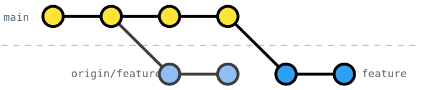

# Rebase onto main with pushed feature

In [exercise 104](../104-local-rebase-onto-main/Readme.md), we showed how we can create a linear history using [`git rebase`](https://git-scm.com/docs/git-rebase).

However, often we already pushed our `feature` to `origin`. Then, Git rebase will only rebase our local feature branch onto main.

To achieve the linear history on `origin`, we need to override the history of `origin/feature` with our local history; i.e., force pushing our branch with [`git push --force`](https://git-scm.com/docs/git-push#Documentation/git-push.txt---force). 

## Exercise

In this exercise, the _RocketFuel_ readme was pushed to `main` making our (also already pushed) `feature` out of sync. Pull the for `main` and rebase the local `feature` branch onto `main` so that you have a linear history. Last, overwrite the `feature` branch on `origin` with the local linear history. 