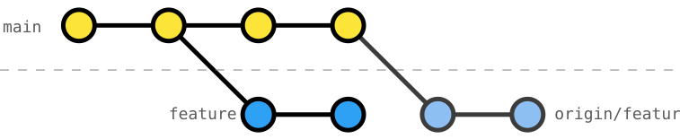

# 204 Rebase Pushed Branches with Teammates (or another PC)

🚧 WIP (this exercise isn't done yet)

TODO Git command, its purpose, and how we can use it to develop a clean git history.

Working with a feature branch that gets rebased (cf. in [exercise 203](../203-remote-rebase-onto-main/Readme.md)), teammates -- or we, working on a different machine -- need to "pull" the changes differently.



There are several ways to "pull" origin:

1. The brute force method: You can delete your local `feature` branch and check out the `origin/feature`
2. A more simple and fast way is to use a hard reset with [`git reset --hard`](https://git-scm.com/docs/git-reset#Documentation/git-reset.txt---hard) onto the _HEAD_ of `origin/feature`
3. If you committed some changes on your local `feature` (you shouldn't have, but if you did), you can [interactively rebase](https://git-scm.com/docs/git-rebase#_interactive_mode) onto the _HEAD_ of `origin/feature`

## Exercise Context

We are working on a _Smart Home_ project, where its configuration is split across three primary data files: `rooms.json`, `devices.json`, and `automation-rules.json`.

TODO current state of the project.

## Task: [Task Title]

TODO this exercise's task

### Initial Git History
```console
$ git log --oneline --graph --decorate --all
TODO git log output after `init.sh`
```
_Note_: ...

### Target Git History
```console
$ git log --oneline --graph --decorate --all
TODO git log output after exercise is done
```
_Note_: ...
