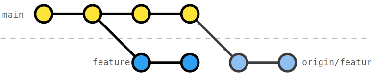

# Rebase of pushed feature branches with teammates

Working with a feature branch that gets rebased (cf. in [exercise 203](../203-remote-rebase-onto-main/Readme.md)), teammates -- or we, working on a different machine -- need to "pull" the changes differently.

There are several ways to "pull" origin:

1. The brute force method: You can delete your local `feature` branch and check out the `origin/feature`
2. A more simple and fast way is to use a hard reset with [`git reset --hard`](https://git-scm.com/docs/git-reset#Documentation/git-reset.txt---hard) onto the _HEAD_ of `origin/feature`
3. If you committed some changes on your local `feature` (you shouldn't have, but if you did), you can [interactively rebase](https://git-scm.com/docs/git-rebase#_interactive_mode) onto the _HEAD_ of `origin/feature`

## Exercise

In this exercise, you are reviewing the feature and checked out the `feature` branch locally. The author of the branch then rebased it onto `main` making your local branch fall behind `origin/feature`. _Reset_ your branch so that the branches are in sync again.