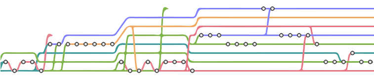

# Git Kata - Clean History

A clean Git history is beneficial to a project in many ways. Similar to how clean code documents the current state of the software, a well-tended Git log documents what changes happened and why. For example,
* _What are the design decision in a pull request?_
* _What has happened since the last fetch?_
* _Why did the implementation of a function change?_
* _Was this a refactoring or a change in functionality?_
* _When did the bug got introduced? (supported by git-bisect)_

However, [good commit messages](https://chris.beams.io/posts/git-commit/) are not enough for a clean Git history, and we need tend to and _refactor_ our history before we "commit" to it; or in other words, [rewrite the history](https://git-scm.com/book/en/v2/Git-Tools-Rewriting-History). For all the questions above, we want to have coherent, small, and working commits. Further, a linear history helps to comprehend the sequence of changes more easily.

To visualize this, we want to go from this kind of Git log (here, only 3 developers worked in parallel)

to this kind of linear history (here, 5 developers worked in parallel)

or even as linear as [OneFlow](https://www.endoflineblog.com/oneflow-a-git-branching-model-and-workflow).

**Note**: This kata assumes that you are already have basic Git knowledge, like how to _stage_ files, _commit_ changes, _push_ to origin, _fetch_ and _pull_ from remote, _branching_, and work with the _Git log_. 

---

## Links and Resources

The [Git version control system](https://git-scm.com/)

### Katas inpired by
* [eficode-academy/git-katas](https://github.com/eficode-academy/git-katas)
* [Git Immersion - A guided tour](https://gitimmersion.com/)

### Naming conventions
* [Git commit message](https://chris.beams.io/posts/git-commit/)
* [Providing context with commit messages](https://testing.googleblog.com/2017/09/code-health-providing-context-with.html)
* [Git branch naming](https://deepsource.io/blog/git-branch-naming-conventions/)

### Workflows
* [Comparing workflows](https://www.atlassian.com/git/tutorials/comparing-workflows)
* [OneFlow](https://www.endoflineblog.com/oneflow-a-git-branching-model-and-workflow)
* [GitFlow overview](https://datasift.github.io/gitflow/IntroducingGitFlow.html)
* [Enhanced GitFlow](https://www.toptal.com/gitflow/enhanced-git-flow-explained)
* [Trunk-based Development](https://trunkbaseddevelopment.com/)

### Merge & Rebase
* [Merge vs Rebase](https://www.atlassian.com/git/tutorials/merging-vs-rebasing)
* [Interactive Rebase](https://www.atlassian.com/git/tutorials/rewriting-history)

### Tutorials & Talks
* [Atlassian learn Git](https://www.atlassian.com/git/tutorials/learn-git-with-bitbucket-cloud)
* [Git Happens - Jessica Kerr](https://www.youtube.com/watch?v=yCh6TSLIQBQ)
* [Git Fu Developing - Sebastian Feldmann](https://www.youtube.com/watch?v=FfaGUy-l1rs)
* [How Effective Teams Use Git - Enrico Campidoglio](https://www.youtube.com/watch?v=jw8yK5JV0xw)
* [Learn Git Branching](https://learngitbranching.js.org/)

### Recommended Git Clients
* [Git-Plugin of JetBrains IDEs](https://www.jetbrains.com/help/idea/version-control-integration.html) (free with community edition IDEs)
* [SmartGit](https://www.syntevo.com/smartgit/) (free/paid)
* [Fork](https://git-fork.com/) (paid)
* [GitKraken](https://www.gitkraken.com/git-client) (free/paid)

### Other Tools
* [gitignore.io](https://www.toptal.com/developers/gitignore)