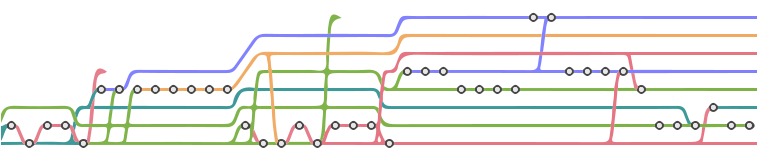

# Git Kata - Clean History

[](https://github.com/andrej-dyck/git-kata/actions/workflows/ci.yml)


A clean Git history is beneficial to a project in many ways.
Similar to how good code documents the current state of the software, a well-tended Git log documents which changes happened and why.
For example,
* _What are the design decisions?_
* _What has happened since the last fetch?_
* _Why did the implementation of a function change?_
* _Is the change a straight-forward refactoring or a change in functionality?_
* _When did the bug get introduced? (supported by git-bisect)_

However, [good commit messages](https://chris.beams.io/posts/git-commit/) are not enough for a clean Git history, and we need to tend to and "refactor" our history before we "commit" to it; or in other words, [rewrite the history](https://git-scm.com/book/en/v2/Git-Tools-Rewriting-History).
To this end, we want to have coherent, small, and working commits (**atomic commits**).
Further, a linear history helps to comprehend the sequence of changes more easily.

To visualize this, we want to go from this kind of Git log (here, 3 developers worked in parallel using [GitFlow overview](https://datasift.github.io/gitflow/IntroducingGitFlow.html))



to this kind of linear history (here, 5 developers worked in parallel using [OneFlow](https://www.endoflineblog.com/oneflow-a-git-branching-model-and-workflow))


or even as linear as [Trunk-based Development](https://trunkbaseddevelopment.com/).


### Note
This kata assumes that you already have basic Git knowledge; e.g., how to _stage_ files, _commit_ changes, _push_ to origin, _fetch_ and _pull_ from remote, _branching_, and work with the _Git log_.

---

## Doing this Git-Kata

**_IMPORTANT_**: 🚧 This Git-Kata is currently under rework. Checkout tag [`2021-git-kata-kotlin-exercise`](https://github.com/andrej-dyck/git-kata/releases/tag/2021-git-kata-kotlin-exercise) (or [`2021-git-kata-osx-kotlin-exercise`](https://github.com/andrej-dyck/git-kata/releases/tag/2021-git-kata-osx-kotlin-exercise) for Mac OS X) for an earlier version.

Each exercise is self-contained, even when they refer to previous exercise numbers; the task is described in the `README.md` file.

Each exercise is safe to experiment with, as a local-only repository is set up by an `init.sh` _bash script_ and, if stuck, you can always re-run the `init.sh` again.

It is highly recommended to use a graphical (GUI) Git client for the exercises.

Each exercise ends in a clean working tree (i.e., `git status` shows no changes), a clean staging area (i.e., `git diff --staged` shows no changes), and a _clean_ history (i.e., `git log --oneline --graph --decorate --all` shows the target history).

---

## How-To / Quick Start

* Ensure the latest [Git](https://git-scm.com/) is installed and available in your terminal
* Navigate to the folder of an exercise; e.g., `101-local-amend-commit`
* Run the corresponding `init.sh` which setups the local repository in `<kata-root>/exercise`
  * NOTE: by default, each exercise will use this folder and overwrite any existing content
* Open the created/updated folder `<kata-root>/exercise` with your favorite Git client
* Consult the `README.md` in that folder for the description and task

### Notes
* On **Windows** with [**Git**]([Git](https://git-scm.com/)) installed, use the _Git Bash_ with `sh init.sh` to execute the script
* On **Linux** / **Mac OS X**, you might need to make the `init.sh` executable with `chmod +x init.sh`
* Use `init.sh "path-to-exercise"` to use a different exercise folder; e.g., `init.sh "./exercise-101"`
  * _Important_: relative links or images in the `README.md` might not work

### Clean-up (optional)
Remove the `exercise` folder and its origin `exercise-origin`. For the default folders, use:
```shell
rm -rf exercise
rm -rf exercise-origin
```

## `jq` Dependency

[jq](https://jqlang.org/) is a lightweight and flexible command-line JSON processor.

If you have `jq` (or `jaq`) installed and in your `PATH`, the `init.sh` script will automatically use it.

Otherwise, the scripts will try to use the bundled `jq` binary (version `jq-1.8.2`).
Or you can install it from [here](https://jqlang.org/).

---

## Recommended Way to Work with Git within a Team

### Atomic Commits
An **atomic commit** represents a _single_, _self-contained_, and _coherent unit of change_ that keeps the codebase in a working and testable state.

If you drop, revert, or extract (cherry-pick) this commit, it should only affect that specific change without breaking anything else.

_Rule of thumb_: if you cannot easily summarize the change in a single concise subject line, the commit is likely not atomic.

### Good Commit Messages
Follow the core principles of [good commit messages](https://chris.beams.io/posts/git-commit/) (adapted with lowercase imperative verbs).

The **subject line** is a concise summary of _what_ the commit does starting with a lowercase imperative verb (e.g., `add`, `introduce`, `draft`, `model`, `configure`, `fix`).
* Guideline: _"If applied, this commit will ..."_

The **body** (optional, separated by an empty line from the subject) explains _why_ the change was made and the context behind it.

### One Main Branch
Maintain one `main` branch for all environments, including production.
It is recommended to protect this `main` branch from history rewrites.

Every commit on `main` must be continuously deployed; i.e., it must be releasable and production-ready.

Avoid long-lived branching schemes (e.g., GitFlow's `develop`, `release`, and `support` branches).

### Short-lived Branches
When using branches, keep them _short-lived_ and integrate them into `main` as soon as possible; ideally within minutes or hours.

Rebase frequently onto `main` to stay in sync and prevent merge conflicts.

---

## Links and Resources

The [Git version control system](https://git-scm.com/)

### Katas inspired by
* [eficode-academy/git-katas](https://github.com/eficode-academy/git-katas)
* [Git Immersion - A guided tour](https://gitimmersion.com/)

### Naming conventions
* [Git commit message](https://chris.beams.io/posts/git-commit/)
* [Providing context with commit messages](https://testing.googleblog.com/2017/09/code-health-providing-context-with.html)
* [Git branch naming](https://deepsource.io/blog/git-branch-naming-conventions/)

### Workflows
* [Comparing workflows](https://www.atlassian.com/git/tutorials/comparing-workflows)
* [Trunk-based Development](https://trunkbaseddevelopment.com/)
* [OneFlow](https://www.endoflineblog.com/oneflow-a-git-branching-model-and-workflow)
* [GitFlow overview](https://datasift.github.io/gitflow/IntroducingGitFlow.html)
* [Enhanced GitFlow](https://www.toptal.com/gitflow/enhanced-git-flow-explained)

### Merge & Rebase
* [Merge vs Rebase](https://www.atlassian.com/git/tutorials/merging-vs-rebasing)
* [Interactive Rebase](https://www.atlassian.com/git/tutorials/rewriting-history)

### Tutorials & Talks
* [Atlassian - learn Git](https://www.atlassian.com/git/tutorials/learn-git-with-bitbucket-cloud)
* [Git Happens - Jessica Kerr](https://www.youtube.com/watch?v=yCh6TSLIQBQ)
* [Git Fu Developing - Sebastian Feldmann](https://www.youtube.com/watch?v=FfaGUy-l1rs)
* [How Effective Teams Use Git - Enrico Campidoglio](https://www.youtube.com/watch?v=jw8yK5JV0xw)
* [Learn Git Branching](https://learngitbranching.js.org/)

### Recommended Git Clients
* [Git-Plugin of JetBrains IDEs (e.g., IntelliJ)](https://www.jetbrains.com/help/idea/version-control-integration.html) (free with community edition IDEs)
* [SmartGit](https://www.syntevo.com/smartgit/) (paid)
* [Fork](https://git-fork.com/) (paid, free evaluation)
* [GitKraken](https://www.gitkraken.com/git-client) (paid, free for OSS)
* here you can find some other [Git-GUIs](https://git-scm.com/tools/guis)

### Other Tools
* [gitignore.io](https://www.toptal.com/developers/gitignore)
