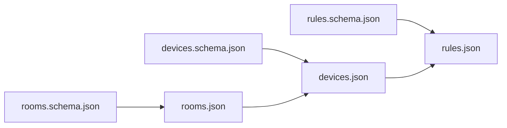

# Smart Home Exercise Rework Plan: Universal Git Kata in JSON & JSON Schema

## Executive Summary & Motivation

The current Git Kata exercises rely on a Kotlin-based "rocket-fuel" calculation domain. While functionally sound, the Kotlin implementation introduces overhead:
1. **Compilation & Tooling Requirements:** Requires JDK, Gradle, and language tooling.
2. **Cognitive Distraction:** Participants often focus on Kotlin syntax, type systems, and test assertions instead of core Git mechanics.
3. **Accessibility Limitations:** Non-JVM developers, QA engineers, DevOps practitioners, and non-programmers face unnecessary barriers.

This rework plan transitions all **19 exercises** (`101`–`111`, `201`–`207`, `301`) to a universal, language-agnostic **Smart Home Configuration** domain in **JSON with JSON Schema (Draft 2020-12)**.

### Key Benefits
- **Zero-runtime execution:** Pure data files; no compilation or test runners needed.
- **Universal compatibility:** Accessible across Windows, macOS, Linux, VS Code, IntelliJ IDEA, and command-line Git.
- **Built-in Schema Validation:** Modern IDEs (IntelliJ, VS Code) natively parse and validate `$schema` references in real time, highlighting errors immediately.
- **Natural Domain Hierarchy:** A clean dependency chain (`rooms` → `devices` → `rules`) provides logical, intuitive rationale for commit ordering, squashing, cherry-picking, and rebasing.
- **Multi-layer Conflicts:** Enables deterministic line-based textual merge conflicts and subtle semantic/referential integrity conflicts (e.g., broken foreign keys, capability mismatches).

---

## Smart Home Domain Specification

The Smart Home configuration is split across three primary data files and three corresponding JSON Schema files:

```text
smart-home/
├── rooms.schema.json
├── devices.schema.json
├── rules.schema.json
├── rooms.json
├── devices.json
└── rules.json
```



### 1. Rooms (`rooms.schema.json` & `rooms.json`)

#### `rooms.schema.json`
```json
{
  "$schema": "https://json-schema.org/draft/2020-12/schema",
  "title": "Smart Home Rooms",
  "type": "object",
  "required": ["rooms"],
  "properties": {
    "$schema": {
      "type": "string"
    },
    "rooms": {
      "type": "array",
      "items": {
        "type": "object",
        "required": ["id", "name", "floor"],
        "properties": {
          "id": {
            "type": "string",
            "pattern": "^[a-z0-9-]+$"
          },
          "name": {
            "type": "string",
            "minLength": 1
          },
          "floor": {
            "type": "integer"
          }
        },
        "additionalProperties": false
      }
    }
  },
  "additionalProperties": false
}
```

#### Standard `rooms.json`
```json
{
  "$schema": "./rooms.schema.json",
  "rooms": [
    {
      "id": "living-room",
      "name": "Living Room",
      "floor": 0
    },
    {
      "id": "kitchen",
      "name": "Kitchen",
      "floor": 0
    },
    {
      "id": "office",
      "name": "Home Office",
      "floor": 1
    },
    {
      "id": "bedroom",
      "name": "Master Bedroom",
      "floor": 1
    }
  ]
}
```

---

### 2. Devices (`devices.schema.json` & `devices.json`)

#### `devices.schema.json`
```json
{
  "$schema": "https://json-schema.org/draft/2020-12/schema",
  "title": "Smart Home Devices",
  "type": "object",
  "required": ["devices"],
  "properties": {
    "$schema": {
      "type": "string"
    },
    "devices": {
      "type": "array",
      "items": {
        "type": "object",
        "required": ["id", "name", "roomId", "type", "state"],
        "properties": {
          "id": {
            "type": "string",
            "pattern": "^[a-z0-9-]+$"
          },
          "name": {
            "type": "string",
            "minLength": 1
          },
          "roomId": {
            "type": "string",
            "pattern": "^[a-z0-9-]+$"
          },
          "type": {
            "type": "string",
            "enum": ["light", "thermostat", "motion-sensor", "smart-plug", "door-sensor"]
          },
          "state": {
            "type": "object",
            "properties": {
              "powered": {
                "type": "boolean"
              },
              "brightness": {
                "type": "integer",
                "minimum": 0,
                "maximum": 100
              },
              "targetTemperatureCelsius": {
                "type": "number",
                "minimum": 10.0,
                "maximum": 35.0
              },
              "motionDetected": {
                "type": "boolean"
              },
              "isOpen": {
                "type": "boolean"
              },
              "maxWattage": {
                "type": "integer",
                "minimum": 1
              }
            },
            "additionalProperties": false
          }
        },
        "additionalProperties": false
      }
    }
  },
  "additionalProperties": false
}
```

#### Standard `devices.json`
```json
{
  "$schema": "./devices.schema.json",
  "devices": [
    {
      "id": "living-room-thermostat",
      "name": "Living Room Thermostat",
      "roomId": "living-room",
      "type": "thermostat",
      "state": {
        "targetTemperatureCelsius": 21.5
      }
    },
    {
      "id": "office-desk-lamp",
      "name": "Office Desk Lamp",
      "roomId": "office",
      "type": "light",
      "state": {
        "powered": false,
        "brightness": 80
      }
    },
    {
      "id": "hallway-motion-sensor",
      "name": "Hallway Motion Sensor",
      "roomId": "living-room",
      "type": "motion-sensor",
      "state": {
        "motionDetected": false
      }
    }
  ]
}
```

---

### 3. Rules (`rules.schema.json` & `rules.json`)

#### `rules.schema.json`
```json
{
  "$schema": "https://json-schema.org/draft/2020-12/schema",
  "title": "Smart Home Automation Rules",
  "type": "object",
  "required": ["rules"],
  "properties": {
    "$schema": {
      "type": "string"
    },
    "rules": {
      "type": "array",
      "items": {
        "type": "object",
        "required": ["id", "name", "enabled", "when", "then"],
        "properties": {
          "id": {
            "type": "string",
            "pattern": "^[a-z0-9-]+$"
          },
          "name": {
            "type": "string",
            "minLength": 1
          },
          "enabled": {
            "type": "boolean"
          },
          "when": {
            "type": "object",
            "properties": {
              "time": {
                "type": "string",
                "pattern": "^(0[0-9]|1[0-9]|2[0-3]):[0-5][0-9]$"
              },
              "days": {
                "type": "array",
                "items": {
                  "type": "string",
                  "enum": ["monday", "tuesday", "wednesday", "thursday", "friday", "saturday", "sunday"]
                }
              },
              "triggerDeviceId": {
                "type": "string"
              },
              "event": {
                "type": "string",
                "enum": ["motionDetected", "doorOpened", "doorClosed"]
              }
            },
            "additionalProperties": false
          },
          "then": {
            "type": "object",
            "required": ["deviceId", "action"],
            "properties": {
              "deviceId": {
                "type": "string"
              },
              "action": {
                "type": "string",
                "enum": ["turnOn", "turnOff", "setBrightness", "setTemperature"]
              },
              "parameters": {
                "type": "object",
                "properties": {
                  "brightness": {
                    "type": "integer",
                    "minimum": 0,
                    "maximum": 100
                  },
                  "targetTemperatureCelsius": {
                    "type": "number",
                    "minimum": 10.0,
                    "maximum": 35.0
                  }
                },
                "additionalProperties": false
              }
            },
            "additionalProperties": false
          }
        },
        "additionalProperties": false
      }
    }
  },
  "additionalProperties": false
}
```

#### Standard `rules.json`
```json
{
  "$schema": "./rules.schema.json",
  "rules": [
    {
      "id": "morning-office-lights",
      "name": "Turn on office lamp on weekday mornings",
      "enabled": true,
      "when": {
        "days": ["monday", "tuesday", "wednesday", "thursday", "friday"],
        "time": "08:30"
      },
      "then": {
        "deviceId": "office-desk-lamp",
        "action": "turnOn",
        "parameters": {
          "brightness": 100
        }
      }
    }
  ]
}
```

---

## 3-Layer Validation Model

To ensure participants understand both Git state and domain state, validation operates on three distinct levels:

| Layer | Type | Description | How It Is Detected |
|---|---|---|---|
| **Layer 1** | **Syntax Validity** | Valid JSON syntax (balanced brackets, quotes, no trailing commas). | Built-in editor JSON parser, syntax highlighter, red error squiggles. |
| **Layer 2** | **Schema Validity** | Strict compliance with `*.schema.json` (required fields, type checks, enum constraints, value ranges). | Native IDE `$schema` engine (VS Code / IntelliJ) with inline validation warnings. |
| **Layer 3** | **Referential Integrity** | Domain foreign keys: every `roomId` exists in `rooms.json`, every `deviceId` exists in `devices.json`, action capabilities match device `type`. | Documented domain rules & lightweight verification script (`./scripts/validate.sh`). |

### Formatting Conventions for Clean Git Diffs
1. **2-space indentation** for all JSON files.
2. **Deterministic key ordering** (`id`, `name`, `roomId`/`floor`, `type`, `state`, `enabled`, `when`, `then`).
3. **One object per block** with closing brackets on dedicated lines to minimize diff hunks.
4. **No trailing commas** (adhering strictly to JSON specification).

---

## Local Exercises Rework Plan (101–111)

### Summary Table: Local Exercises

| Exercise ID | Topic | Smart Home Scenario | Primary Git Tool / Command |
|---|---|---|---|
| `101-local-amend-commit` | Amend Last Commit | Fix typo in `roomId` and remove leftover debug flag `"testMode": true`. | `git commit --amend` |
| `102-local-commit-changes` | Patch Staging | Separate thermostat temperature adjustment from new motion sensor addition. | `git add -p` / `git commit` |
| `103-local-undo-last-commit` | Soft Reset & Rework | Undo unfinished WIP rule with placeholder values, complete it, and re-commit. | `git reset --soft HEAD~1` |
| `104-local-rebase-onto-main` | Linear Rebase | Rebase kitchen room & device additions on top of main's garden update. | `git rebase main` |
| `105-local-rebase-with-conflicts` | Rebase Conflicts | Resolve conflicting thermostat temperatures and adjust renamed room reference. | `git rebase main` + conflict resolution |
| `106-local-interactive-rebase-reorder-commits` | Reorder Commits | Fix inverted commit history: Schema → Room → Device → Rule. | `git rebase -i` (reorder `pick` lines) |
| `107-local-interactive-rebase-squash-commits` | Squash & Fixup | Condense incremental typo fixes and minor tweaks into clean atomic feature commits. | `git rebase -i` (`squash`, `fixup`) |
| `108-local-interactive-rebase-reword-commits` | Reword Messages | Replace sloppy messages (`"stuff"`, `"WIP rules"`) with conventional imperative messages. | `git rebase -i` (`reword`) |
| `109-local-interactive-rebase-edit-commits` | Edit Earlier Commit | Migrate temperature scale from Fahrenheit to Celsius and cascade through rules. | `git rebase -i` (`edit`) |
| `110-local-interactive-rebase-split-commits` | Split Monolithic Commit | Unbundle combined security setup into distinct room, device, and rule commits. | `git rebase -i` (`edit`) + `git reset HEAD~1` |
| `111-local-interactive-rebase-delete-commits` | Drop & Reorder Fixup | Drop temporary debug overrides and squash schema fix into device definition. | `git rebase -i` (`drop`, `fixup`) |

---

### Detailed Local Exercise Specifications

#### 101: `101-local-amend-commit`
- **Scenario:** The user just committed the addition of `bedroom-lamp` in `devices.json`, but accidentally committed a typo in `roomId` (`"bedrrom"`) and left a debug property `"testMode": true` (which fails schema validation).
- **Initial History:**
  ```text
  * a1b2c3d (HEAD -> main) WIP lamp
  * f0e9d8c initialize smart home setup
  ```
- **Initial Working State:**
  ```json
  // devices.json
  {
    "id": "bedroom-lamp",
    "name": "Bedroom Lamp",
    "roomId": "bedrrom",
    "type": "light",
    "testMode": true,
    "state": { "powered": false, "brightness": 100 }
  }
  ```
- **Instructions to Participant:**
  1. Open `devices.json` and fix `"roomId": "bedroom"`.
  2. Remove `"testMode": true` so the file passes schema validation.
  3. Stage `devices.json` and amend the commit with message `"configure bedroom lamp"`.
- **Target History:**
  ```text
  * e4f5a6b (HEAD -> main) configure bedroom lamp
  * f0e9d8c initialize smart home setup
  ```

---

#### 102: `102-local-commit-changes`
- **Scenario:** The working tree contains two distinct, unrelated edits in `devices.json`: 1) A bugfix adjusting `targetTemperatureCelsius` on `living-room-thermostat`, 2) A new feature adding `hallway-motion-sensor`.
- **Initial Working State:**
  ```diff
  --- a/devices.json
  +++ b/devices.json
  @@ -6,3 +6,3 @@
         "type": "thermostat",
         "state": {
  -        "targetTemperatureCelsius": 18.0
  +        "targetTemperatureCelsius": 21.5
         }
  @@ -20,1 +20,9 @@
       }
  +    ,
  +    {
  +      "id": "hallway-motion-sensor",
  +      "name": "Hallway Motion Sensor",
  +      "roomId": "living-room",
  +      "type": "motion-sensor",
  +      "state": {
  +        "motionDetected": false
  +      }
  +    }
  ```
- **Instructions to Participant:**
  1. Use interactive patch staging (`git add -p devices.json`) to select only the temperature fix hunk.
  2. Commit with message `"fix living room thermostat target temperature"`.
  3. Stage the remaining addition and commit with message `"install hallway motion sensor"`.
- **Target History:**
  ```text
  * c3d4e5f (HEAD -> main) install hallway motion sensor
  * b2c3d4e fix living room thermostat target temperature
  * a1b2c3d initialize smart home setup
  ```

---

#### 103: `103-local-undo-last-commit`
- **Scenario:** A premature commit `"WIP: night light rule"` was created containing invalid placeholder values (`"action": "TODO"`, missing parameters).
- **Initial History:**
  ```text
  * c3d4e5f (HEAD -> main) WIP: night light rule
  * b2c3d4e install hallway motion sensor
  * a1b2c3d initialize smart home setup
  ```
- **Instructions to Participant:**
  1. Undo the last commit while keeping the changes staged in the working directory using `git reset --soft HEAD~1`.
  2. Complete `rules.json` with valid action `"turnOn"` and parameter `"brightness": 20`.
  3. Commit the finished rule with message `"create night light automation rule"`.
- **Target History:**
  ```text
  * d4e5f6a (HEAD -> main) create night light automation rule
  * b2c3d4e install hallway motion sensor
  * a1b2c3d initialize smart home setup
  ```

---

#### 104: `104-local-rebase-onto-main`
- **Scenario:** You have worked on branch `feature/kitchen-setup` adding the kitchen room and kitchen lights. Meanwhile, `main` was updated with a new garden room. You need to cleanly rebase your branch on top of `main`.
- **Initial History:**
  ```text
  * c4d5e6f (HEAD -> feature/kitchen-setup) install kitchen lights
  * b3c4d5e define kitchen room
  | * e5f6a7b (main) define garden room and outdoor lights
  |/
  * a1b2c3d initialize smart home setup
  ```
- **Instructions to Participant:**
  1. Rebase `feature/kitchen-setup` onto `main` (`git rebase main`).
  2. Verify linear history and schema validity.
- **Target History:**
  ```text
  * g7h8i9j (HEAD -> feature/kitchen-setup) install kitchen lights
  * f6g7h8i define kitchen room
  * e5f6a7b (main) define garden room and outdoor lights
  * a1b2c3d initialize smart home setup
  ```

---

#### 105: `105-local-rebase-with-conflicts`
- **Scenario:** You are rebasing `feature/climate-control` onto `main`. Two layers of conflict occur:
  1. **Textual Conflict:** Both `main` and your feature modified the default temperature of `living-room-thermostat`.
  2. **Semantic Conflict:** `main` renamed room `"living-room"` to `"lounge"`. Your new fan device references `"roomId": "living-room"`, which is now broken.
- **Conflict Details:**
  ```json
  <<<<<<< HEAD
          "targetTemperatureCelsius": 22.0
  =======
          "targetTemperatureCelsius": 20.5
  >>>>>>> install living room ceiling fan
  ```
- **Instructions to Participant:**
  1. Run `git rebase main`.
  2. Resolve the textual conflict in `devices.json` (accepting `21.0`).
  3. Check referential integrity: update the new fan's `roomId` to `"lounge"`.
  4. Stage `devices.json` and run `git rebase --continue`.
- **Target History:** Linear rebased branch with valid JSON, schema, and foreign keys.

---

#### 106: `106-local-interactive-rebase-reorder-commits`
- **Scenario:** Commits were accidentally made in reverse order of logical dependency (Rule → Device → Room → Docs).
- **Initial History:**
  ```text
  * d4e5f6a (HEAD -> main) document office setup
  * c3d4e5f define office room
  * b2c3d4e configure office desk lamp
  * a1b2c3d create morning office lighting rule
  ```
- **Instructions to Participant:**
  1. Start interactive rebase: `git rebase -i HEAD~4`.
  2. Reorder commits into the proper dependency order:
     - 1. `document office setup` (or Room)
     - 2. `define office room`
     - 3. `configure office desk lamp`
     - 4. `create morning office lighting rule`
  3. Save and complete rebase.

---

#### 107: `107-local-interactive-rebase-squash-commits`
- **Scenario:** The feature branch has 5 fragmented commits with typos, fixups, and incremental tweaks.
- **Initial History:**
  ```text
  * e5f6a7b (HEAD -> main) create breakfast coffee rule
  * d4e5f6a adjust coffee maker wattage
  * c3d4e5f configure kitchen smart plug
  * b2c3d4e fix typo in kitchen room name
  * a1b2c3d define kitchen room
  ```
- **Instructions to Participant:**
  1. Run `git rebase -i HEAD~5`.
  2. `fixup` commit `b2c3d4e` into `a1b2c3d` (Room setup).
  3. `squash` commit `d4e5f6a` into `c3d4e5f` (Devices).
  4. Keep `create breakfast coffee rule` as an independent commit.
- **Target History:** Exactly 3 atomic, clean commits.

---

#### 108: `108-local-interactive-rebase-reword-commits`
- **Scenario:** Commits have sloppy, non-descriptive messages (`"stuff"`, `"json fix"`, `"WIP rules"`).
- **Initial History:**
  ```text
  * c3d4e5f (HEAD -> main) WIP rules
  * b2c3d4e json fix
  * a1b2c3d stuff
  ```
- **Instructions to Participant:**
  1. Run `git rebase -i HEAD~3`.
  2. Mark all commits with `reword`.
  3. Provide standardized imperative messages:
     - `"define balcony room in floor plan"`
     - `"configure smart plug for balcony planter"`
     - `"create sunset balcony lighting rule"`

---

#### 109: `109-local-interactive-rebase-edit-commits`
- **Scenario:** An earlier commit introduced device state using Fahrenheit (`"targetTemperatureF": 72`). Downstream commits added automation rules referencing Fahrenheit. The project decision is to standardize on Celsius.
- **Initial History:**
  ```text
  * b2c3d4e (HEAD -> main) create eco mode climate rule (uses Fahrenheit)
  * a1b2c3d configure bedroom thermostat (uses targetTemperatureF)
  ```
- **Instructions to Participant:**
  1. Run `git rebase -i HEAD~2` and mark `a1b2c3d` as `edit`.
  2. When rebase pauses, update `devices.json` to use `"targetTemperatureCelsius": 22.0`.
  3. Amend the commit (`git commit --amend`).
  4. Continue rebase (`git rebase --continue`), which will pause on conflict in the rule commit.
  5. Update the rule parameter in `rules.json` to `"targetTemperatureCelsius": 19.0`.
  6. Stage and finish rebase.

---

#### 110: `110-local-interactive-rebase-split-commits`
- **Scenario:** A single monolithic commit `"integrate complete home security system"` modified `rooms.json`, `devices.json`, and `rules.json` all at once.
- **Initial History:**
  ```text
  * a1b2c3d (HEAD -> main) integrate complete home security system
  ```
- **Instructions to Participant:**
  1. Run `git rebase -i HEAD~1` and mark the commit as `edit`.
  2. Reset commit while keeping working directory intact: `git reset HEAD~1`.
  3. Selectively stage and create 3 atomic commits:
     - `git add rooms.json && git commit -m "define security rooms"`
     - `git add devices.json && git commit -m "configure door sensor and siren devices"`
     - `git add rules.json && git commit -m "create intruder alert automation rule"`
  4. Finish rebase: `git rebase --continue`.

---

#### 111: `111-local-interactive-rebase-delete-commits`
- **Scenario:** History contains a leftover test commit `"DEBUG: scratch experimental devices"` that introduced a temporary `test-device` and an invalid debug property, plus a later commit fixing a schema enum.
- **Initial History:**
  ```text
  * d4e5f6a (HEAD -> main) create hallway light schedule rule
  * c3d4e5f fix smart-plug enum in schema
  * b2c3d4e DEBUG: scratch experimental devices
  * a1b2c3d configure smart plug device
  ```
- **Instructions to Participant:**
  1. Run `git rebase -i HEAD~4`.
  2. Mark `b2c3d4e` (`DEBUG: ...`) as `drop` (or delete the line).
  3. Move `c3d4e5f` right after `a1b2c3d` and mark it `fixup`.
  4. Save and complete rebase.

---

## Remote & Advanced Exercises Rework Plan (201–207, 301)

### Summary Table: Remote & Advanced Exercises

| Exercise ID | Topic | Smart Home Scenario | Primary Git Tool / Command |
|---|---|---|---|
| `201-remote-amend-commit` | Amend Pushed Commit | Fix missing `maxWattage` property on pushed smart plug device. | `git commit --amend` + `git push --force-with-lease` |
| `202-remote-undo-last-commit` | Undo & Rewrite Remote Commit | Soft-reset pushed WIP auto-shutdown rule, finish rule, and overwrite remote. | `git reset --soft` + `git push --force-with-lease` |
| `203-remote-rebase-onto-main` | Rebase Remote Feature Branch | Rebase security feature branch onto updated `origin/main` schema & room definitions. | `git fetch` + `git rebase origin/main` + `--force-with-lease` |
| `204-remote-rebase-with-teammates` | Sync with Rewritten Remote | Align local branch with teammate's force-pushed clean climate branch. | `git fetch` + `git reset --hard origin/feature` |
| `205-remote-interactive-rebase` | Full Remote Feature Cleanup | Clean 6 messy commits (typos, unordered records, fixups) into 3 atomic commits. | `git rebase -i origin/main` + `--force-with-lease` |
| `206-remote-cherry-pick-commit-on-main` | Cherry-pick Mistaken Commit | Move security rule committed accidentally on `main` to feature branch; reset `main`. | `git cherry-pick` + `git reset --hard` + push |
| `207-remote-reflog-restore-lost-commits` | Reflog Commit Recovery | Recover lost smart blinds rule commits after an accidental `git reset --hard`. | `git reflog` + `git reset --hard <sha>` |
| `301-remote-advanced-interactive-rebase` | Multi-commit Schema Migration | Rewrite root history to migrate legacy flat power/temperature schema to nested state. | `git rebase -i --root` + cascading conflict fixes |

---

### Detailed Remote & Advanced Exercise Specifications

#### 201: `201-remote-amend-commit`
- **Scenario:** The user added a smart plug to `devices.json` and pushed to `origin/feature/smart-plug`. However, the smart plug violates `devices.schema.json` because the required `"maxWattage"` integer is missing.
- **Initial State:**
  ```text
  Local:   * a1b2c3d (HEAD -> feature/smart-plug, origin/feature/smart-plug) configure kitchen smart plug
  ```
  ```json
  // devices.json (missing maxWattage)
  {
    "id": "kitchen-coffee-plug",
    "name": "Coffee Maker Plug",
    "roomId": "kitchen",
    "type": "smart-plug",
    "state": { "powered": false }
  }
  ```
- **Instructions to Participant:**
  1. Open `devices.json` and add `"maxWattage": 2200` under `state`.
  2. Stage and amend: `git commit --amend`.
  3. Safely update remote: `git push --force-with-lease origin feature/smart-plug`.

---

#### 202: `202-remote-undo-last-commit`
- **Scenario:** An incomplete WIP rule commit `"WIP: auto-off lights"` with `"action": "TODO"` was prematurely pushed to `origin/feature/night-mode`.
- **Initial State:**
  ```text
  Local & Remote: * b2c3d4e (HEAD -> feature/night-mode, origin/feature/night-mode) WIP: auto-off lights
  ```
- **Instructions to Participant:**
  1. Soft-reset the commit: `git reset --soft HEAD~1`.
  2. Complete `rules.json` with `"action": "turnOff"` targeting `living-room-lights` at `23:30`.
  3. Commit cleanly: `git commit -m "create midnight light auto-off rule"`.
  4. Push to remote: `git push --force-with-lease origin feature/night-mode`.

---

#### 203: `203-remote-rebase-onto-main`
- **Scenario:** The participant's feature branch `feature/door-sensors` has 2 commits adding front and back door sensors. While working, `origin/main` was updated with schema extensions for alarm systems and a `hallway` room.
- **Initial History:**
  ```text
  * c3d4e5f (HEAD -> feature/door-sensors, origin/feature/door-sensors) configure back door sensor
  * b2c3d4e configure front door sensor
  | * e5f6a7b (origin/main, main) define hallway room and security schema
  |/
  * a1b2c3d initialize smart home setup
  ```
- **Instructions to Participant:**
  1. Fetch latest changes: `git fetch origin`.
  2. Rebase feature branch onto `origin/main`: `git rebase origin/main`.
  3. Verify schemas and data integrity.
  4. Update remote branch: `git push --force-with-lease origin feature/door-sensors`.

---

#### 204: `204-remote-rebase-with-teammates`
- **Scenario:** A teammate interactively rebased and cleaned up `feature/climate` (squashing 4 messy commits into 1 clean commit) and force-pushed to `origin/feature/climate`. The participant's local branch is now diverged and behind.
- **Initial State:**
  ```text
  * 9999999 (origin/feature/climate) implement living room climate control
  | * 4444444 (HEAD -> feature/climate) fix typo in temp
  | * 3333333 adjust thermostat
  | * 2222222 WIP temp
  | * 1111111 configure thermostat
  |/
  * a1b2c3d initialize smart home setup
  ```
- **Instructions to Participant:**
  1. Fetch origin: `git fetch origin`.
  2. Observe the divergence with `git log --all --graph --oneline`.
  3. Align local branch cleanly with teammate's remote branch using `git reset --hard origin/feature/climate`.
  4. Confirm working directory is clean and matching remote.

---

#### 205: `205-remote-interactive-rebase`
- **Scenario:** The feature branch `feature/entertainment-room` has been pushed to `origin`, but contains 5 disorganized commits (unordered room definition, soundbar plug, TV backlight, typo fix, and rule).
- **Initial History:**
  ```text
  * e5f6a7b (HEAD -> feature/entertainment-room, origin/feature/entertainment-room) create movie time rule
  * d4e5f6a fix typo in backlight name
  * c3d4e5f configure TV backlight
  * b2c3d4e define media room
  * a1b2c3d configure soundbar smart plug
  ```
- **Instructions to Participant:**
  1. Rebase interactively onto `origin/main`: `git rebase -i origin/main`.
  2. Reorder and squash:
     - Reorder Room definition to be first.
     - Squash/fixup typo into TV backlight commit.
     - Group smart devices logically.
     - Place automation rule at the end.
  3. Force push cleaned history: `git push --force-with-lease origin feature/entertainment-room`.

---

#### 206: `206-remote-cherry-pick-commit-on-main`
- **Scenario:** While intending to add a security rule on `feature/security-rules`, the participant accidentally committed and pushed `"create motion-triggered alarm rule"` directly to `origin/main`.
- **Initial History:**
  ```text
  * 8888888 (origin/main, main) create motion-triggered alarm rule [MISTAKE]
  | * 7777777 (HEAD -> feature/security-rules, origin/feature/security-rules) configure siren device
  |/
  * a1b2c3d initialize smart home setup
  ```
- **Instructions to Participant:**
  1. Checkout feature branch: `git checkout feature/security-rules`.
  2. Cherry-pick the mistake commit: `git cherry-pick main` (or `8888888`).
  3. Push feature branch: `git push origin feature/security-rules`.
  4. Switch back to `main`: `git checkout main`.
  5. Reset `main` to remove the mistaken commit: `git reset --hard HEAD~1`.
  6. Force push `main`: `git push --force-with-lease origin main`.

---

#### 207: `207-remote-reflog-restore-lost-commits`
- **Scenario:** While attempting to clean up `feature/smart-blinds`, a mistaken `git reset --hard origin/main` was executed, discarding 3 local commits that added blinds devices and sunset automation rules before they were pushed.
- **Initial State:**
  ```text
  HEAD points to origin/main.
  Commits "configure bedroom smart blinds", "configure living room smart blinds", and "create sunset blinds schedule" seem lost.
  ```
- **Instructions to Participant:**
  1. Run `git reflog` to inspect the HEAD history.
  2. Locate the commit SHA just before the hard reset (e.g., `HEAD@{1}` or `c4d5e6f`).
  3. Restore the branch pointer: `git reset --hard c4d5e6f`.
  4. Perform clean rebase onto `main`: `git rebase main`.
  5. Push feature branch: `git push -u origin feature/smart-blinds`.

---

#### 301: `301-remote-advanced-interactive-rebase`
- **Scenario (Grand Kata):** The entire repository was historically created using a legacy schema v1:
  - Legacy fields: `"powerStatus": "ON"` (string instead of boolean in `state.powered`), `"temperature_f": 72` (flat integer Fahrenheit instead of nested Celsius).
  - 6 historical commits spanning:
    1. `initialize legacy schema and rooms`
    2. `configure living room heater and lamp`
    3. `install kitchen lights and kettle plug`
    4. `create evening climate automation rule`
    5. `create morning kitchen routine rule`
    6. `update smart home documentation`
- **Instructions to Participant:**
  1. Initiate root interactive rebase: `git rebase -i --root`.
  2. Mark commit #1 (`initialize legacy schema and rooms`) as `edit`.
  3. Replace schema with modernized JSON Schema Draft 2020-12 supporting `state: { powered, brightness, targetTemperatureCelsius }`.
  4. Amend commit #1 and continue.
  5. As rebase pauses on subsequent commits due to conflicts:
     - Convert device definitions from `"powerStatus": "ON"` to `"state": { "powered": true }`.
     - Convert temperatures to `targetTemperatureCelsius`.
     - Update rule parameters and triggers to match new schema properties.
  6. Continue through all commits until complete.
  7. Validate entire repository against JSON Schema.
  8. Force push rewritten repository: `git push --force-with-lease origin main`.

---

## Script Infrastructure, Tooling & Verification

### 1. Repository Structure & Resource Layout

In place of `resources/RocketFuelPart0` and `resources/RocketFuelPart1`, the repository will house smart home resource templates under `resources/SmartHome`:

```text
resources/
└── SmartHome/
    ├── schemas/
    │   ├── rooms.schema.json
    │   ├── devices.schema.json
    │   └── rules.schema.json
    ├── base/
    │   ├── rooms.json
    │   ├── devices.json
    │   └── rules.json
    └── fragments/
        ├── kitchen-room.json
        ├── bedroom-lamp.json
        ├── security-sensors.json
        └── legacy-v1/
            ├── schema.json
            └── devices.json
```

### 2. Helper Scripts Refactoring (`scripts/`)

The existing helper scripts in `scripts/file-functions.sh` and `scripts/git-functions.sh` can be simplified:
- **Replacing Kotlin regex line-manipulations:** Instead of fragile line-index replacements (`change_line_in_file 14 ...`), exercise `init.sh` scripts can copy predefined clean JSON files or append clean object fragments.
- **Git State Generators:** Retain standard functions (`git_init_with_initial_commit`, `git_commit_file`, `create_remote_exercise_repo`) while standardizing author names and deterministic timestamps across platforms.

### 3. Verification Strategy

Participants and workshop instructors have two immediate ways to verify exercise solutions:

#### A. Editor-Native Validation (Recommended, Zero Setup)
Both IntelliJ IDEA and VS Code support JSON Schema Draft 2020-12 out-of-the-box via the `"$schema"` property:
- **IntelliJ IDEA:** Automatically detects relative schema references (`"$schema": "./devices.schema.json"`), activates syntax highlighting, field completion, and marks invalid types or missing required keys with red highlights.
- **VS Code:** Native built-in JSON language server automatically parses `$schema` links and reports diagnostics in the **Problems** tab.

#### B. CLI Schema & Domain Verification (`./scripts/validate.sh`)
An optional zero-dependency Python or Bash validation script can be provided to check all three validation layers:
```bash
./scripts/validate.sh
```
Checks performed:
1. Syntax validation (valid JSON parse).
2. Schema structure compliance against `*.schema.json`.
3. Referential integrity (every `roomId` in `devices.json` exists in `rooms.json`, every `deviceId` in `rules.json` exists in `devices.json`).

---

## Standard Exercise Templates

### 1. Standard `Readme.md` Template

Each exercise directory (`101`–`111`, `201`–`207`, `301`) will use a consistent, participant-friendly structure:

````markdown
# Exercise [ID]: [Exercise Title]

## Goal
A clear 1–2 sentence description of the target Git state and history.

## Background Story
A concise explanation of the smart home configuration scenario (e.g., adding a device, fixing an invalid room ID, or rebasing onto updated room configurations).

## Starting State
- **Branch:** `main` (or `feature/...`)
- **Git History:** ASCII commit tree visualization
- **Files Involved:** `devices.json`, `rooms.json`, etc.

## Task Instructions
1. Step 1 (e.g. Inspect the current commit history using `git log --oneline`).
2. Step 2 (e.g. Identify the invalid property in `devices.json`).
3. Step 3 (e.g. Apply the appropriate Git command).

## Expected Result
- **Commit History:** ASCII diagram of the resulting linear history.
- **File State:** Validation confirmation (clean schema validation, no broken foreign keys).

## Useful Commands
```bash
git <command> ...
```
````

---

### 2. Standard `init.sh` Template

````bash
#!/usr/bin/env bash
set -euo pipefail

source "$(dirname "${BASH_SOURCE[0]}")/../scripts/index.sh"
# source "$REPO_ROOT_DIR/<other-exercise>/init.sh"

init-exercise() {
  local exerciseDir="$1"

  cd "$exerciseDir"
  echo "TODO stuff in $exerciseDir"
}

run-init-exercise "$@"
````

---

## Implementation Roadmap & Next Steps

1. **Create Base Smart Home Resources:**
   - Create schemas in `resources/SmartHome/schemas/` (`rooms.schema.json`, `devices.schema.json`, `rules.schema.json`).
   - Create baseline configurations in `resources/SmartHome/base/`.
2. **Refactor Shared Scripts:**
   - Add JSON-friendly utilities in `scripts/file-functions.sh`.
   - Add optional `./scripts/validate.sh`.
3. **Migrate Local Exercises (101–111):**
   - Update `101`–`111` `init.sh` and `Readme.md` files.
4. **Migrate Remote Exercises (201–207):**
   - Update `201`–`207` `init.sh` and `Readme.md` files.
5. **Migrate Advanced Grand Kata (301):**
   - Update `301` `init.sh` and `Readme.md` files for full interactive rebase schema migration.
6. **Instructor & Participant Smoke Test:**
   - Run end-to-end `init.sh` execution and solution walkthrough across macOS, Linux, and Windows Git Bash.
